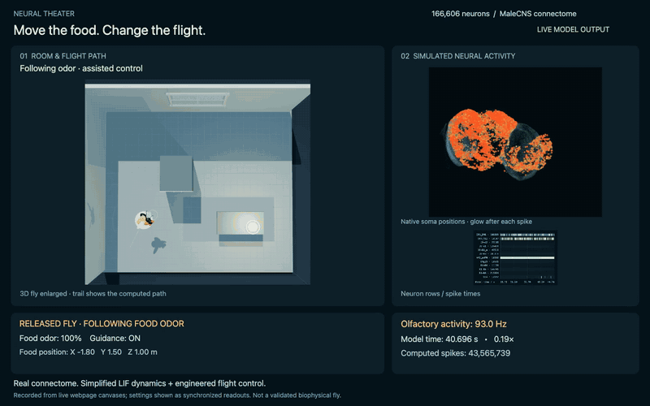

# Flybrain Playground｜果蝇脑互动实验室

[English README](README.md) · [在线演示](https://flybrain-theater.ming1001.chatgpt.site/)

在房间中移动灯光、食物和声源，观察虚拟果蝇的飞行轨迹与计算得到的神经活动。
支持设置起点、改变窗户与遮挡物，以及旋转、平移和缩放 3D 神经元视图。

模型使用 MaleCNS v1.0 的 166,606 个已分类神经元和 25,574,615 条连接。
139,659 个神经元有真实胞体坐标；其余神经元参与计算，但不会被画在虚构位置。
这是 **真实连接组＋简化 LIF 神经元＋人工设计的感觉编码和飞行控制**，
不是完整生物物理果蝇，也不是经过实验验证的行为预测。

## 视频演示：移动食物，改变飞行轨迹

[](https://github.com/mingdianliu/flybrain-playground/raw/refs/heads/main/docs/media/flybrain-demo.mp4)

**[下载完整 54 秒 MP4](https://github.com/mingdianliu/flybrain-playground/raw/refs/heads/main/docs/media/flybrain-demo.mp4)** ·
[录制说明](docs/VIDEO.md)

上方动态预览按原速播放完整片段；下载 1440 × 900、30 fps 的 MP4，
可更清楚地查看神经图表。

约 **第 8 秒**，食物从 X −1.8 米移到 +1.6 米；开启趋食辅助的果蝇随之改变轨迹，
嗅觉放电也发生变化。视频由网页运行时的画布、同步设置读数和事件说明合成，
播放未加速；模拟时间按视频中显示的计算速度推进。

## 本地复现

需要 Node.js 22+、Python 3.12–3.14，以及支持 WebGL 2 的桌面浏览器。
建议预留约 4 GB 磁盘空间。无需 API key、neuPrint 登录、Codex 或网站托管账户。

先克隆仓库：

```sh
git clone https://github.com/mingdianliu/flybrain-playground.git
cd flybrain-playground
```

然后在仓库根目录运行：

```sh
python3 -m venv .venv
source .venv/bin/activate
python -m pip install -r requirements.txt
npm ci
python scripts/prepare-data.py
npm start
```

Windows PowerShell 前两步改为 `py -3 -m venv .venv` 和
`.\.venv\Scripts\Activate.ps1`。也可以直接调用虚拟环境里的 Python。

打开 http://127.0.0.1:4173/（中文）或 http://127.0.0.1:4173/en.html（英文），
等待连接组加载完成，然后点击“释放果蝇”。

首次准备会从 Janelia 官方公共地址下载约 1.1 GB 的三个 Feather 表，验证固定的
SHA-256，导出约 78 MB 的模型并验证解压后的数组。已有且通过校验的原始文件
可以离线重用。数据不放进 Git，复现过程也不依赖演示网站在线。

从 [GitHub Releases](https://github.com/mingdianliu/flybrain-playground/releases)
下载 `malecns-v1.0-model.zip` 后，可用标准库直接安装，
无需 NumPy 和 PyArrow：

```sh
python scripts/install-data.py /path/to/malecns-v1.0-model.zip
npm start
```

## 检查与构建

```sh
npm test                         # 不需要大数据的快速检查
python scripts/verify-data.py     # 校验全部模型数据
npm run test:full                 # 用真实全量图计算放电与交互
npm run benchmark                # 输出四类刺激的基准结果
npm run build                    # 生成可独立托管的 dist/ 网站
npm run preview                  # 本地预览构建结果
```

原始数据在其他目录时可运行：

```sh
python scripts/prepare-data.py --raw-dir /path/to/raw-tables --offline
```

视频中的食物实验：关闭窗户和视觉输入，开启食物气味与趋食辅助，
将食物放在 X −1.8、Y 1.5、Z 1.0 米。释放果蝇后，把食物 X 移到 +1.6 米，
观察轨迹和嗅觉放电变化。全量模型可能慢于现实时间，界面会显示计算速度；
声源目前只刺激模型，不播放电脑声音，也没有预设的转向动作。

代码采用 [MIT](LICENSE)，MaleCNS 原始与派生数据保留 CC BY 4.0。
详见 [第三方署名](THIRD_PARTY_NOTICES.md)、[模型边界](docs/MODEL.md)、
[数据格式](docs/DATA_FORMAT.md) 和 [复现说明](docs/REPRODUCIBILITY.md)。
